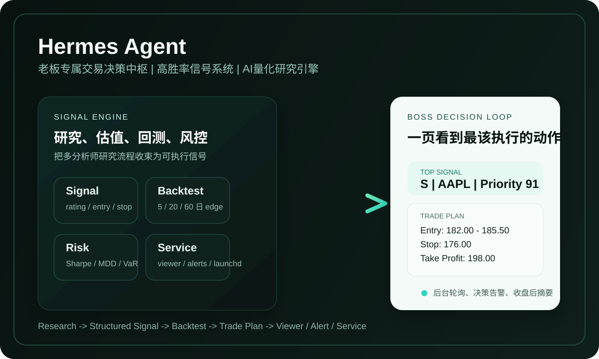

# Hermes Agent

> 老板专属交易决策中枢  
> 高胜率信号系统，背后是一套可持续运行的 AI 量化研究引擎。



## 这套系统解决什么问题

Hermes 不是通用金融产品，也不是给多人协作的量化平台。

它只做一件事：为老板持续输出更值得执行的交易信号，并把信号变成可以直接跟单的交易计划。

它的目标不是“写一篇看起来很聪明的研究报告”，而是稳定回答这几个更直接的问题：

- 现在最值得执行的股票信号是什么
- 为什么是它，而不是另一个 `S` 级信号
- 具体该怎么买，跌到哪里止损，涨到哪里止盈
- 这套评级历史上到底有没有 edge

## 老板最终会得到什么

### 1. 结构化交易信号

每次研究结果都不是模糊观点，而是结构化信号：

- `rating`
- `confidence`
- `entry_price`
- `stop_loss`
- `take_profit`
- `holding_horizon`
- `signal_valid_until`
- `priority_score`

### 2. 回测证明，而不只是叙事

Hermes 已经具备 `5 / 20 / 60` 交易日回测闭环，可以按 `S / A / B / C` 分桶统计：

- 胜率
- 平均收益
- 中位收益
- 最大回撤
- 盈亏比

这意味着系统不只是“会说”，而是能回答：

- `S` 级信号历史上值不值得跟
- `A` 级和 `S` 级差距有多大
- 哪个持有周期更适合执行

### 3. 明确交易计划

强信号会进一步生成交易计划，而不是只给一句“看多”：

- 是否执行
- 建议入场区间
- 止损位
- 止盈位
- 建议仓位
- 信号失效条件

### 4. 后台盯盘与查看入口

Hermes 已具备：

- `macOS launchd` 服务化启动
- 健康检查与降级模式
- 收盘后低频轮询
- 极简 Web Viewer

老板只需要打开一个页面，就能看见：

- 当前信号
- 信号优先级
- 持仓
- 告警
- 模拟仓状态

## 系统能力总览

### 信号引擎

- `grading` 输出统一的结构化信号 schema
- `signals / price_snapshots / signal_revisions` 完整落库
- 信号可版本化、可追溯、可比较

### 回测闭环

- `signal_outcomes` 存储真实回测结果
- Yahoo Finance 历史价格接入
- gap handling
- 按 `grade` 分桶 edge 汇总

### 交易执行层

- `TradePlanGenerator`
- 持仓记录与状态跟踪
- `paper trade` 模拟执行
- 决策型告警而不是通用提醒

### 数据质量与排序

- Provider 抽象层
- Yahoo Finance / AkShare 可切换接入
- 字段校验、新鲜度检测、fallback
- 证据冲突检测
- 组合上下文下的信号优先级排序
- Analyst 动态加权

### 估值与风控

- `DCF`
- `DDM`
- 相对估值
- `Sharpe Ratio`
- `Max Drawdown`
- `VaR`
- 极端行情压力测试

### 服务与查看器

- `launchd plist` 自启
- 健康检查与恢复
- 降级模式
- 最小 Web 页面
- 收盘后简版复盘摘要

## 一次完整决策是怎么出来的

1. 多分析师研究同一只股票  
   基本面、新闻、技术面、宏观与研究结论被整合到统一决策输入。

2. 评级层生成结构化信号  
   不是只输出 `S/A/B/C`，而是一起给出 entry、stop、take-profit、horizon、priority。

3. 信号进入回测闭环  
   系统会把信号和后续真实价格结果关联，持续统计哪些等级真的有 edge。

4. 信号被转换为交易计划  
   包括执行与否、入场区间、仓位建议、止盈止损和失效条件。

5. 后台服务持续运行  
   市场开启时轮询，异常时降级，恢复后继续工作。

6. 老板通过极简查看页获取结果  
   看到当前最值得执行的信号、已有持仓、告警和模拟交易状态。

## 为什么这不是普通 AI 选股脚本

普通 AI 选股脚本通常停在“生成观点”。

Hermes 已经完整打通了下面这条主线：

- 研究
- 结构化信号
- 回测验证
- 交易计划
- 持仓与告警
- 服务化运行
- 最小查看器

它不是一次性的问答脚本，而是一个老板单人使用场景下的交易决策系统骨架。

## 快速开始

### 环境要求

- Python `3.11+`
- 可用的 LLM API 配置
- macOS 服务模式需要 `launchd`

### 安装依赖

```bash
pip install -r requirements.txt
```

### 运行研究与信号

```bash
python -m agent.research_v1.cli "分析 AAPL"
```

### 启动最小查看器

```bash
python -m agent.research_v1.viewer
```

### 安装 macOS 服务

```bash
./install.sh
```

## 架构概览

核心模块位于 `agent/research_v1`：

- `grading.py`：信号评级与结构化输出
- `signal_pipeline.py`：研究结果落库
- `backtest.py` / `backtest_pipeline.py`：回测闭环
- `trade_plan.py` / `paper_trade.py`：交易计划与模拟执行
- `signal_quality.py` / `analyst_weighting.py`：信号质量与优先级
- `valuation_models.py` / `risk_metrics.py`：估值与风险引擎
- `service_manager.py` / `macos_service.py`：服务模式
- `viewer.py`：极简查看入口

系统主线规划见 [roadmap.md](roadmap.md)，更完整的能力说明见 [docs/system-overview.md](docs/system-overview.md)。

## 当前非目标

Hermes 当前明确不做这些事：

- 多人协作平台
- 通用金融终端
- 复杂产品化界面
- 围绕老板主观行为做自适应策略

它的重点始终是：

- 提升信号质量
- 提升胜率与盈亏比
- 提升长期 ROI
- 提升执行清晰度

## 免责声明

Hermes 是研究与信号系统，不构成投资建议。

市场有风险，策略有效性会随市场环境变化。任何真实交易前，都应结合资金约束、风险承受能力和独立判断。

## License

MIT License. See [LICENSE](LICENSE).