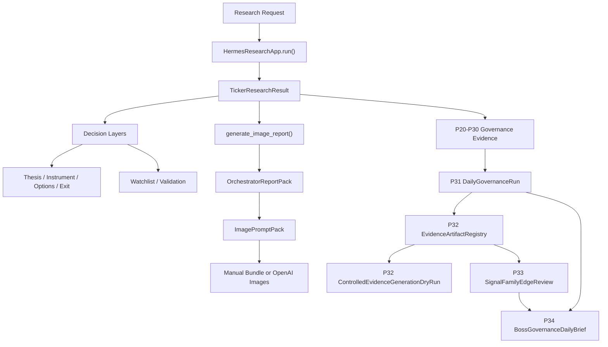

# Hermes

Hermes is a boss-first trading research and governance system.

It turns ticker research requests into structured financial conclusions, bullish
instrument recommendations, boss-facing reports, and now an auditable governance
evidence loop that helps decide whether a system version, signal family, or
shadow model is ready for continued observation or human review.

Hermes is not an auto-trading bot. It does not approve production adoption by
itself, mutate production calibration config, or promote shadow model outputs
into canonical trading decisions.

## Current Version

The current active development line is:

```text
codex/quant-governance-p20-p30
```

This branch has moved beyond the old P20 starting point. It now includes:

- P20-P23 factor logging, cost-aware returns, diagnostics, and shadow calibration
- P24-P26 shadow experiment admission, registry, training datasets, splits, and portfolio evidence
- P27 factor expansion governance
- P28 execution realism
- P29 human production adoption dossier
- P30 evidence-gated advanced model admission
- P31 readiness dossiers and daily governance run
- P32 evidence artifact registry and dry-run generation validator
- P33 signal-family edge review
- P34 boss governance daily brief

## What Hermes Answers

Hermes is built to answer:

```text
What should we pay attention to now, why, what evidence supports it,
how should it be expressed, and is the evidence chain mature enough
for human review?
```

It does this in four layers:

1. Research decision layer
   - request routing
   - market data collection
   - multi-role evidence gathering
   - final signal and report generation
   - thesis, instrument, options, exit, watchlist, and validation layers

2. Boss delivery layer
   - report-pack assembly
   - image prompt generation
   - manual or OpenAI image-report generation

3. Quant governance layer
   - factor snapshots
   - forward return observations
   - validity diagnostics
   - shadow calibration
   - shadow experiment registration and observation
   - execution realism checks
   - production adoption review artifacts

4. Governance evidence loop
   - version readiness review
   - signal-family readiness review
   - daily governance run
   - artifact registry
   - dry-run evidence generation manifest
   - edge review
   - boss governance daily brief

## Current Product Status

| Capability | Status |
|---|---|
| Canonical research pipeline | Shipped |
| Futu-first market data path | Shipped |
| Thesis / instrument / options / exit layers | Shipped |
| Watchlist / validation layers | Shipped |
| Manual image-report pipeline | Shipped |
| OpenAI image-report automation | Shipped |
| P20-P23 factor diagnostics and shadow calibration foundation | Shipped |
| P24-P26 shadow experiment and portfolio governance | Shipped |
| P28 execution realism | Shipped |
| P29 production adoption dossier | Shipped, human-review only |
| P30 advanced model admission | Shipped, sandbox-only |
| P31 readiness dossiers and daily governance run | Shipped |
| P32 evidence artifact registry and dry-run generator | Shipped |
| P33 signal-family edge review | Shipped |
| P34 boss governance daily brief | Shipped |
| CLI/viewer integration for governance loop | Deferred |
| Actual controlled evidence generation | Future phase |
| Auto-trading | Explicit non-goal |

## Main System Flow



## Governance Loop

The latest governance path is:

```text
P31 DailyGovernanceRun
  -> P32-A EvidenceArtifactRegistry
  -> P32-B ControlledEvidenceGenerationDryRun
  -> P33 SignalFamilyEdgeReview
  -> P34 BossGovernanceDailyBrief
```

### P31: Readiness Dossiers

P31 adds:

- `VersionReadinessDossier`
- `SignalFamilyReadinessDossier`
- `DailyGovernanceRun`

It answers:

- Is this Hermes version ready for human production-readiness review?
- Is this signal/factor/shadow family blocked, observation-only, or ready for human review?
- Can a daily governance run summarize version and family state into JSON/Markdown?

Outputs live under:

```text
output/governance/YYYY-MM-DD/
```

### P32: Evidence Artifact Pack

P32 adds:

- `EvidenceArtifactRegistry`
- `ControlledEvidenceGenerationDryRun`

P32-A scans existing governance artifacts and classifies them as:

- `present`
- `missing`
- `stale`
- `invalid`

P32-B validates requests to generate missing evidence, but v1 is dry-run only.
It does not run P22 diagnostics, P25 training, P28 execution realism, or any
model-training job.

### P33: Signal Family Edge Review

P33 adds:

- `SignalFamilyEdgeReviewReport`

It reviews whether a signal/factor/shadow family has enough evidence to continue
shadow observation or enter human review.

It enforces:

- P22 diagnostics when factor validity is claimed
- net-return basis for positive edge claims
- lookahead/source-audit blockers
- P25/P26 evidence for shadow model families
- P28 execution realism when required
- shadow-only and sandbox-only promotion boundaries

### P34: Boss Governance Daily Brief

P34 adds:

- `BossGovernanceDailyBrief`

It converts P31-P33 governance outputs into a boss-readable daily summary:

- system health
- missing evidence
- stale evidence
- review candidates
- families still in shadow observation
- blocked families
- risk warnings
- next governance actions

It does not provide trade instructions.

## Hard Boundaries

Hermes must not:

- auto-trade
- send broker orders
- approve production adoption automatically
- mutate production calibration config from diagnostics or shadow reports
- promote shadow model outputs into canonical factor fields
- train advanced models without explicit future phase approval
- bypass P22 data-integrity checks
- bypass P24-P30 shadow-only or sandbox-only rules
- turn gross-only evidence into a positive edge claim
- present boss governance briefs as buy/sell instructions

Positive governance statuses mean readiness for human review, not production
approval.

## Approved Boss-Facing Action Vocabulary

Trading/report outputs should stay inside this bullish-only action vocabulary:

- `Buy Stock`
- `Buy Call`
- `Bull Call Spread`
- `Sell Cash-Secured Put`
- `Covered Call`
- `Watchlist`
- `No Trade`

Generic visible language such as `BUY/HOLD/SELL` must not become the primary
boss-facing report language.

## Important Entry Points

### Research

```python
from agent.research_v1.app import HermesResearchApp

app = HermesResearchApp()
research = app.run("Research AAPL fundamentals and options")
```

### Boss Image Report

```python
for tr in research.ticker_results:
    report = app.generate_image_report(
        tr,
        company_name="Apple Inc.",
        mode="manual",
        output_dir="output/image_reports",
    )
```

### Governance Readiness

Core modules:

```text
agent/research_v1/version_readiness.py
agent/research_v1/signal_family_readiness.py
agent/research_v1/daily_governance.py
```

### Governance Evidence Loop

Core modules:

```text
agent/research_v1/evidence_artifact_registry.py
agent/research_v1/evidence_generation_dry_run.py
agent/research_v1/signal_family_edge_review.py
agent/research_v1/boss_governance_brief.py
```

## Verification

Use Python 3.11:

```bash
/opt/homebrew/bin/python3.11
```

### P31-P34 Governance Loop

```bash
/opt/homebrew/bin/python3.11 -m pytest \
  tests/agent/research_v1/test_version_readiness.py \
  tests/agent/research_v1/test_signal_family_readiness.py \
  tests/agent/research_v1/test_daily_governance.py \
  tests/agent/research_v1/test_evidence_artifact_registry.py \
  tests/agent/research_v1/test_evidence_generation_dry_run.py \
  tests/agent/research_v1/test_signal_family_edge_review.py \
  tests/agent/research_v1/test_boss_governance_brief.py \
  -q
```

Recent result:

```text
55 passed, 2 warnings
```

The warnings are benign `PytestCollectionWarning` messages for the `TestEvidence`
dataclass name.

### Full P20-P34 Governance Chain

```bash
/opt/homebrew/bin/python3.11 -m pytest \
  tests/agent/research_v1/test_p20_factor_contracts.py \
  tests/agent/research_v1/test_p20_pnl_integrity.py \
  tests/agent/research_v1/test_p21_calibration_inputs.py \
  tests/agent/research_v1/test_p22_a_plus_validity_integrity_health.py \
  tests/agent/research_v1/test_p23_shadow_calibration.py \
  tests/agent/research_v1/test_p23_shadow_observation_loop.py \
  tests/agent/research_v1/test_p24_entry_gate.py \
  tests/agent/research_v1/test_p24_experiment_registry.py \
  tests/agent/research_v1/test_p24_shadow_runner.py \
  tests/agent/research_v1/test_p24_run_persistence.py \
  tests/agent/research_v1/test_p24_health_report.py \
  tests/agent/research_v1/test_phase25_model_governance.py \
  tests/agent/research_v1/test_p25_xgboost_shadow_adapter.py \
  tests/agent/research_v1/test_p25_training_dataset_builder.py \
  tests/agent/research_v1/test_p25_split_manifest_builder.py \
  tests/agent/research_v1/test_p25_shadow_training_runner.py \
  tests/agent/research_v1/test_phase26_shadow_portfolio.py \
  tests/agent/research_v1/test_phase27_factor_expansion.py \
  tests/agent/research_v1/test_phase28_execution_realism.py \
  tests/agent/research_v1/test_phase29_production_adoption_review.py \
  tests/agent/research_v1/test_phase30_advanced_model_pack.py \
  tests/agent/research_v1/test_version_readiness.py \
  tests/agent/research_v1/test_signal_family_readiness.py \
  tests/agent/research_v1/test_daily_governance.py \
  tests/agent/research_v1/test_evidence_artifact_registry.py \
  tests/agent/research_v1/test_evidence_generation_dry_run.py \
  tests/agent/research_v1/test_signal_family_edge_review.py \
  tests/agent/research_v1/test_boss_governance_brief.py \
  -q
```

Recent result:

```text
543 passed, 2 warnings
```

## Known Test Gap

`tests/agent/research_v1/test_doc_standards.py` currently has known
pre-existing documentation failures:

- `agent/research_v1/README.md` is missing a required Data Flow / How It Fits heading.
- `agent/research_v1/report_templates/` has Python files but no `README.md`.

These are documentation hygiene gaps and are not part of the P31-P34 governance
implementation.

## Useful Paths

| Path | Purpose |
|---|---|
| `agent/research_v1/` | Canonical research, reporting, and governance modules |
| `tests/agent/research_v1/` | Unit and governance regression tests |
| `docs/superpowers/specs/` | Phase specs and design docs |
| `docs/superpowers/plans/` | Implementation plans and executor prompts |
| `output/governance/` | Governance JSON/Markdown outputs |
| `output/image_reports/` | Image-report outputs |

## Key Docs

- [Research module guide](agent/research_v1/README.md)
- [Research module agent guide](agent/research_v1/AGENT.md)
- [P31 governance readiness design](docs/superpowers/specs/2026-04-29-hermes-governance-readiness-design.md)
- [P31 governance readiness plan](docs/superpowers/plans/2026-04-29-governance-readiness.md)
- [P32-P34 governance evidence loop spec](docs/superpowers/specs/2026-04-29-hermes-p32-p34-governance-evidence-loop-spec.md)
- [P32-P34 governance evidence loop plan](docs/superpowers/plans/2026-04-29-p32-p34-governance-evidence-loop.md)
- [P29 production adoption review spec](docs/superpowers/specs/2026-04-26-hermes-phase29-production-adoption-review-pack-spec.md)
- [P30 advanced model pack spec](docs/superpowers/specs/2026-04-26-hermes-phase30-advanced-model-pack-spec.md)

## Operator Guidance

If you are a model, agent, or operator newly entering this repository:

1. Read this file.
2. Read `agent/research_v1/README.md`.
3. Read `agent/research_v1/AGENT.md`.
4. Treat `HermesResearchApp.run()` as the research truth.
5. Treat `generate_image_report()` as downstream boss-report delivery.
6. Treat P31-P34 governance outputs as advisory evidence, not production approval.
7. Do not add auto-trading or production promotion paths without a new approved spec.
