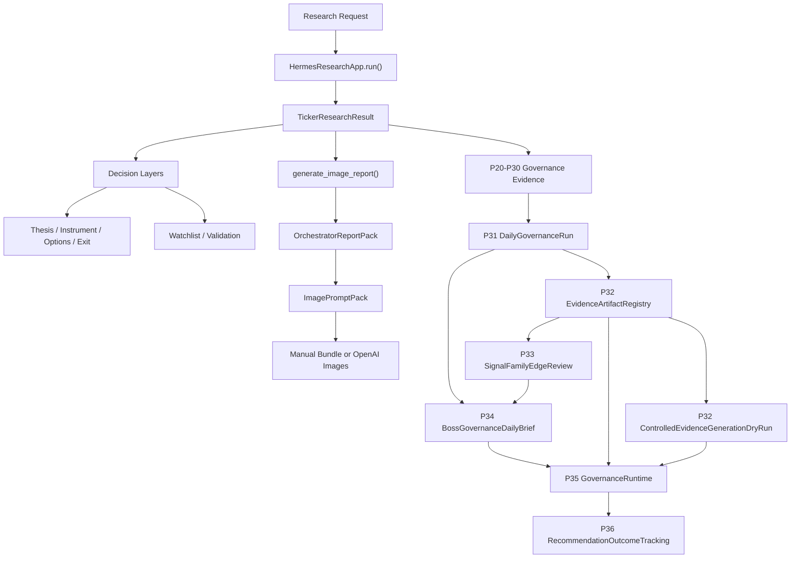

# Hermes

Hermes is a boss-first trading research and governance system.

It turns ticker research requests into structured financial conclusions, bullish
instrument recommendations, boss-facing reports, and an auditable governance
runtime that helps decide whether a system version, signal family, or shadow
model is ready for continued observation or human review.

Hermes is not an auto-trading bot. It does not approve production adoption by
itself, mutate production calibration config, or promote shadow model outputs
into canonical trading decisions.

## Current Version

The current active development line is:

```text
codex/quant-governance-p20-p30
```

This branch has moved beyond the old P20 starting point. It now includes:

- P20-P23 factor logging, cost-aware returns, diagnostics, and shadow calibration
- P24-P26 shadow experiment admission, registry, training datasets, splits, and portfolio evidence
- P27 factor expansion governance
- P28 execution realism
- P29 human production adoption dossier
- P30 evidence-gated advanced model admission
- P31 readiness dossiers and daily governance run
- P32 evidence artifact registry and dry-run generation validator
- P33 signal-family edge review
- P34 boss governance daily brief
- P35 local governance runtime, CLI entrypoint, and documentation standards closure
- P36 recommendation outcome tracking
- P37 market regime context
- P38 fundamental quality engine
- P39 candidate pool discovery

## What Hermes Answers

Hermes is built to answer:

```text
What should we pay attention to now, why, what evidence supports it,
how should it be expressed, and is the evidence chain mature enough
for human review?
```

It does this in four layers:

1. Research decision layer
   - request routing
   - market data collection
   - multi-role evidence gathering
   - final signal and report generation
   - thesis, instrument, options, exit, watchlist, and validation layers

2. Boss delivery layer
   - report-pack assembly
   - image prompt generation
   - manual or OpenAI image-report generation

3. Quant governance layer
   - factor snapshots
   - forward return observations
   - validity diagnostics
   - shadow calibration
   - shadow experiment registration and observation
   - execution realism checks
   - production adoption review artifacts

4. Governance evidence loop
   - version readiness review
   - signal-family readiness review
   - daily governance run
   - artifact registry
   - dry-run evidence generation manifest
   - edge review
   - boss governance daily brief
   - local governance runtime and CLI wrapper
   - recommendation outcome tracking

## Current Product Status

| Capability | Status |
|---|---|
| Canonical research pipeline | Shipped |
| Futu-first market data path | Shipped |
| Thesis / instrument / options / exit layers | Shipped |
| Watchlist / validation layers | Shipped |
| Manual image-report pipeline | Shipped |
| OpenAI image-report automation | Shipped |
| P20-P23 factor diagnostics and shadow calibration foundation | Shipped |
| P24-P26 shadow experiment and portfolio governance | Shipped |
| P28 execution realism | Shipped |
| P29 production adoption dossier | Shipped, human-review only |
| P30 advanced model admission | Shipped, sandbox-only |
| P31 readiness dossiers and daily governance run | Shipped |
| P32 evidence artifact registry and dry-run generator | Shipped |
| P33 signal-family edge review | Shipped |
| P34 boss governance daily brief | Shipped |
| P35 local governance runtime and CLI | Shipped |
| Documentation standards for research module | Shipped |
| P36 recommendation outcome tracking | Shipped |
| Governance viewer integration | Deferred |
| Actual controlled evidence generation | Deferred |
| Auto-trading | Explicit non-goal |

## Main System Flow



## Governance Loop

The latest governance path is:

```text
P31 DailyGovernanceRun
  -> P32-A EvidenceArtifactRegistry
  -> P32-B ControlledEvidenceGenerationDryRun
  -> P33 SignalFamilyEdgeReview
  -> P34 BossGovernanceDailyBrief
  -> P35 GovernanceRuntime / governance-run CLI
  -> P36 RecommendationOutcomeTracking / outcome-run CLI
```

### P31: Readiness Dossiers

P31 adds:

- `VersionReadinessDossier`
- `SignalFamilyReadinessDossier`
- `DailyGovernanceRun`

It answers:

- Is this Hermes version ready for human production-readiness review?
- Is this signal/factor/shadow family blocked, observation-only, or ready for human review?
- Can a daily governance run summarize version and family state into JSON/Markdown?

Outputs live under:

```text
output/governance/YYYY-MM-DD/
```

### P32: Evidence Artifact Pack

P32 adds:

- `EvidenceArtifactRegistry`
- `ControlledEvidenceGenerationDryRun`

P32-A scans existing governance artifacts and classifies them as:

- `present`
- `missing`
- `stale`
- `invalid`

P32-B validates requests to generate missing evidence, but v1 is dry-run only.
It does not run P22 diagnostics, P25 training, P28 execution realism, or any
model-training job.

### P33: Signal Family Edge Review

P33 adds:

- `SignalFamilyEdgeReviewReport`

It reviews whether a signal/factor/shadow family has enough evidence to continue
shadow observation or enter human review.

It enforces:

- P22 diagnostics when factor validity is claimed
- net-return basis for positive edge claims
- lookahead/source-audit blockers
- P25/P26 evidence for shadow model families
- P28 execution realism when required
- shadow-only and sandbox-only promotion boundaries

### P34: Boss Governance Daily Brief

P34 adds:

- `BossGovernanceDailyBrief`

It converts P31-P33 governance outputs into a boss-readable daily summary:

- system health
- missing evidence
- stale evidence
- review candidates
- families still in shadow observation
- blocked families
- risk warnings
- next governance actions

It does not provide trade instructions.

### P35: Governance Runtime

P35 adds:

- `GovernanceRuntimeRequest`
- `GovernanceRuntimeResult`
- `run_governance_runtime(...)`
- `hermes-research governance-run`

It gives operators and review models one controlled local entrypoint for the
P31-P34 loop. It reads explicit JSON config, adapts that config into existing
P31-P34 request contracts, writes machine-readable and Markdown artifacts under
`output/governance/YYYY-MM-DD/`, and returns structured status.

P35 also closes the research-module documentation standards gaps:

- `agent/research_v1/README.md` now includes current data flow.
- `agent/research_v1/report_templates/README.md` exists.
- `tests/agent/research_v1/test_doc_standards.py` passes.

P35 is still governance-only. It does not run real evidence generation jobs,
train models, schedule work, send notifications, open a viewer, place trades, or
approve production adoption.

### P36: Recommendation Outcome Tracking

P36 adds standalone canonical outcome tracking. It reads prior canonical
recommendations, resolves the boss-facing action from canonical reports,
evaluates eligible `Buy Stock` and `Buy Call` recommendations against forward
market data, and writes `p36_recommendation_outcomes.{json,md}` under
`output/governance/YYYY-MM-DD/`.

P36 is not a broker, scheduler, backtester, model trainer, production approver,
or P35 runtime extension. It is an append-only audit loop with natural-key
idempotence over `(signal_id, horizon_days, evaluated_for_date, data_source_hash)`.

Core module:

```text
agent/research_v1/recommendation_outcomes.py
```

CLI:

```bash
python -m agent.research_v1.batch_cli outcome-run \
  --as-of-date 2026-04-30 \
  --output-root output/governance \
  --limit 100 \
  --flat-cost-bps 0
```

## Hard Boundaries

Hermes must not:

- auto-trade
- send broker orders
- approve production adoption automatically
- mutate production calibration config from diagnostics or shadow reports
- promote shadow model outputs into canonical factor fields
- train advanced models without explicit future phase approval
- bypass P22 data-integrity checks
- bypass P24-P30 shadow-only or sandbox-only rules
- turn gross-only evidence into a positive edge claim
- present boss governance briefs as buy/sell instructions

Positive governance statuses mean readiness for human review, not production
approval.

## Approved Boss-Facing Action Vocabulary

Trading/report outputs should stay inside this bullish-only action vocabulary:

- `Buy Stock`
- `Buy Call`
- `Bull Call Spread`
- `Sell Cash-Secured Put`
- `Covered Call`
- `Watchlist`
- `No Trade`

Generic visible language such as `BUY/HOLD/SELL` must not become the primary
boss-facing report language.

## Important Entry Points

### Research

```python
from agent.research_v1.app import HermesResearchApp

app = HermesResearchApp()
research = app.run("Research AAPL fundamentals and options")
```

### Boss Image Report

```python
for tr in research.ticker_results:
    report = app.generate_image_report(
        tr,
        company_name="Apple Inc.",
        mode="manual",
        output_dir="output/image_reports",
    )
```

### Governance Readiness

Core modules:

```text
agent/research_v1/version_readiness.py
agent/research_v1/signal_family_readiness.py
agent/research_v1/daily_governance.py
```

### Governance Evidence Loop

Core modules:

```text
agent/research_v1/evidence_artifact_registry.py
agent/research_v1/evidence_generation_dry_run.py
agent/research_v1/signal_family_edge_review.py
agent/research_v1/boss_governance_brief.py
```

### P35 Governance Runtime

Core module:

```text
agent/research_v1/governance_runtime.py
```

CLI:

```bash
python -m agent.research_v1.batch_cli governance-run \
  --config path/to/governance_config.json \
  --run-date 2026-04-30 \
  --output-root output/governance
```

The CLI default output root is resolved under `--app-root` when a relative path
is provided.

### P36 Recommendation Outcome Tracking

Core module:

```text
agent/research_v1/recommendation_outcomes.py
```

CLI:

```bash
python -m agent.research_v1.batch_cli outcome-run \
  --as-of-date 2026-04-30 \
  --output-root output/governance \
  --limit 100 \
  --flat-cost-bps 0
```

The `outcome-run` command reads canonical signals, resolves actions from
canonical reports, evaluates eligible recommendations, and writes P36 artifacts.
It does not place trades, train models, or approve production adoption.

Minimum config shape:

```json
{
  "version_readiness": {
    "version_id": "p35-local",
    "branch": "codex/quant-governance-p20-p30",
    "commit": "local",
    "evidence": {
      "p20_p30_regression_passed": true,
      "p31_p34_regression_passed": true,
      "doc_standards_passed": true
    },
    "notes": "local governance runtime"
  },
  "signal_families": [],
  "expected_artifacts": [],
  "generation_requests": [],
  "edge_reviews": []
}
```

Invalid JSON or structurally invalid config returns `blocked_invalid_config`.
Write failures return `governance_degraded`. Requests with
`allow_actual_execution=true` remain blocked by P32-B dry-run rules.

### P37 Market Regime Context

Core module:

```text
agent/research_v1/market_regime_context.py
```

CLI:

```bash
python -m agent.research_v1.batch_cli market-regime-run \
  --as-of-date 2026-04-30 \
  --lookback-days 90 \
  --output-root output/governance
```

P37 adds standalone daily market-regime context. It computes index trend,
volatility, breadth, risk appetite, and sector rotation from market proxy
histories, persists append-only `market_regime_snapshots`, and writes
`p37_market_regime_snapshot.{json,md}` under `output/governance/YYYY-MM-DD/`.

P37 is context evidence only. It does not change ticker recommendations,
call `final_judge`, train models, schedule jobs, send notifications, place
trades, or approve production adoption.

### P38 Fundamental Quality Engine

Core module:

```text
agent/research_v1/fundamental_quality.py
```

CLI:

```bash
python -m agent.research_v1.batch_cli fundamental-quality-run \
  --input /path/to/fundamentals.json \
  --as-of-date 2026-04-30 \
  --output-root output/governance
```

P38 adds standalone deterministic fundamental-quality scoring from
point-in-time financial rows. It computes profitability, growth quality,
cash conversion, balance-sheet strength, dilution, and stability dimensions,
persists append-only `fundamental_quality_reports`, and writes
`p38_fundamental_quality.{json,md}` under `output/governance/YYYY-MM-DD/`.

P38 is evidence only. It does not change ticker recommendations, call
`final_judge`, alter `RoleWeightConfig`, inject into `JudgeInputPacket`,
train models, schedule jobs, send notifications, place trades, or approve
production adoption.

### P39 Candidate Pool Engine

Core module:

```text
agent/research_v1/candidate_pool.py
```

CLI:

```bash
python -m agent.research_v1.batch_cli candidate-pool-run \
  --input /path/to/universe.json \
  --as-of-date 2026-04-30 \
  --output-root output/governance \
  --max-candidates 20
```

P39 screens a point-in-time ticker universe and ranks research candidates
using deterministic momentum, quality (P38), regime (P37), liquidity, risk,
and track-record component scores. It joins read-only P36/P37/P38 evidence
when available, assigns candidate categories, and writes
`p39_candidate_pool.{json,md}` under `output/governance/YYYY-MM-DD/`.

P39 is candidate-discovery evidence only. It does not call
`HermesResearchApp.run()`, `final_judge`, create `CanonicalSignal` or
`CanonicalReport`, place orders, train models, schedule jobs, or mutate
P36/P37/P38 evidence.

### P40 Research Memory Pack

```
agent/research_v1/research_memory_pack.py
```

CLI:

```bash
python -m agent.research_v1.batch_cli memory-pack-run \
  --tickers AAPL,MSFT \
  --as-of-date 2026-04-30 \
  --lookback-days 180 \
  --output-root output/governance
```

P40 builds deterministic ticker-level memory packs from prior Hermes
research signals, reports, outcomes, candidate history, quality (P38),
regime (P37), watchlist, and validation context. It writes
`p40_research_memory_pack.{json,md}` under `output/governance/YYYY-MM-DD/`.

P40 is research-memory evidence only. It does not call
`HermesResearchApp.run()`, `final_judge`, create `CanonicalSignal` or
`CanonicalReport`, place orders, train models, schedule jobs, or mutate
P35-P39 evidence.

### P41 Decision Journal Guardrails

```
agent/research_v1/decision_journal_guardrails.py
```

CLI:

```bash
python -m agent.research_v1.batch_cli decision-journal-run \
  --input /path/to/decision_journal.json \
  --as-of-date 2026-04-30 \
  --output-root output/governance
```

P41 records boss decision context and emits deterministic behavioral
guardrail flags (urgency, concentration, drawdown, stale thesis, missing
evidence). It writes `p41_decision_journal.{json,md}` under
`output/governance/YYYY-MM-DD/`.

P41 is behavioral guardrail evidence only. It does not block action,
call `HermesResearchApp.run()`, `final_judge`, place orders, or alter
recommendations.

## Important Files for New Models

If another model is taking over, read these files first, in this order:

1. `README.md`
   - current system map, phase status, hard boundaries, verification commands
2. `agent/research_v1/README.md`
   - research module data flow and local ownership rules
3. `agent/research_v1/AGENT.md`
   - agent responsibilities, boundaries, and change-propagation expectations
4. `agent/research_v1/app.py`
   - `HermesResearchApp.run()` and the canonical research entrypoint
5. `agent/research_v1/orchestrator.py`
   - research workflow control and evidence gathering
6. `agent/research_v1/final_judge.py`
   - canonical signal and report decision construction
7. `agent/research_v1/governance_runtime.py`
   - P35 runtime wrapper around P31-P34
8. `agent/research_v1/daily_governance.py`
   - P31 daily governance run
9. `agent/research_v1/evidence_artifact_registry.py`
   - P32 artifact registry
10. `agent/research_v1/evidence_generation_dry_run.py`
    - P32-B dry-run validator
11. `agent/research_v1/signal_family_edge_review.py`
    - P33 signal-family edge review
12. `agent/research_v1/boss_governance_brief.py`
    - P34 boss daily brief
13. `agent/research_v1/batch_cli.py`
    - local CLI, including `governance-run` and `outcome-run`
14. `agent/research_v1/recommendation_outcomes.py`
    - P36 recommendation outcome tracking
15. `docs/superpowers/specs/2026-04-30-hermes-p35-governance-runtime-design.md`
    - P35 design
16. `docs/superpowers/plans/2026-04-30-p35-governance-runtime.md`
    - P35 implementation plan and verification commands

For regression behavior, read the matching tests in `tests/agent/research_v1/`,
especially:

- `test_governance_runtime.py`
- `test_batch_cli.py`
- `test_doc_standards.py`
- `test_signal_family_edge_review.py`

## Verification

Use Python 3.11:

```bash
/opt/homebrew/bin/python3.11
```

### P36 Focused

```bash
/opt/homebrew/bin/python3.11 -m pytest \
  tests/agent/research_v1/test_recommendation_outcomes.py \
  -q
```

### P37 Focused

```bash
/opt/homebrew/bin/python3.11 -m pytest \
  tests/agent/research_v1/test_market_regime_context.py \
  -q
```

### P38 Focused

```bash
/opt/homebrew/bin/python3.11 -m pytest \
  tests/agent/research_v1/test_fundamental_quality.py \
  -q
```

### P39 Focused

```bash
/opt/homebrew/bin/python3.11 -m pytest \
  tests/agent/research_v1/test_candidate_pool.py \
  -q
```

### P40 Focused

```bash
/opt/homebrew/bin/python3.11 -m pytest \
  tests/agent/research_v1/test_research_memory_pack.py \
  -q
```

### P41 Focused

```bash
/opt/homebrew/bin/python3.11 -m pytest \
  tests/agent/research_v1/test_decision_journal_guardrails.py \
  -q
```

### P35 Focused

```bash
/opt/homebrew/bin/python3.11 -m pytest \
  tests/agent/research_v1/test_governance_runtime.py \
  tests/agent/research_v1/test_batch_cli.py \
  tests/agent/research_v1/test_doc_standards.py \
  -q
```

### P31-P35 Governance Loop

```bash
/opt/homebrew/bin/python3.11 -m pytest \
  tests/agent/research_v1/test_version_readiness.py \
  tests/agent/research_v1/test_signal_family_readiness.py \
  tests/agent/research_v1/test_daily_governance.py \
  tests/agent/research_v1/test_evidence_artifact_registry.py \
  tests/agent/research_v1/test_evidence_generation_dry_run.py \
  tests/agent/research_v1/test_signal_family_edge_review.py \
  tests/agent/research_v1/test_boss_governance_brief.py \
  tests/agent/research_v1/test_governance_runtime.py \
  -q
```

Recent result:

```text
60 passed
```

### Full P20-P41 Governance Chain

```bash
/opt/homebrew/bin/python3.11 -m pytest \
  tests/agent/research_v1/test_p20_factor_contracts.py \
  tests/agent/research_v1/test_p20_pnl_integrity.py \
  tests/agent/research_v1/test_p21_calibration_inputs.py \
  tests/agent/research_v1/test_p22_a_plus_validity_integrity_health.py \
  tests/agent/research_v1/test_p23_shadow_calibration.py \
  tests/agent/research_v1/test_p23_shadow_observation_loop.py \
  tests/agent/research_v1/test_p24_entry_gate.py \
  tests/agent/research_v1/test_p24_experiment_registry.py \
  tests/agent/research_v1/test_p24_shadow_runner.py \
  tests/agent/research_v1/test_p24_run_persistence.py \
  tests/agent/research_v1/test_p24_health_report.py \
  tests/agent/research_v1/test_phase25_model_governance.py \
  tests/agent/research_v1/test_p25_xgboost_shadow_adapter.py \
  tests/agent/research_v1/test_p25_training_dataset_builder.py \
  tests/agent/research_v1/test_p25_split_manifest_builder.py \
  tests/agent/research_v1/test_p25_shadow_training_runner.py \
  tests/agent/research_v1/test_phase26_shadow_portfolio.py \
  tests/agent/research_v1/test_phase27_factor_expansion.py \
  tests/agent/research_v1/test_phase28_execution_realism.py \
  tests/agent/research_v1/test_phase29_production_adoption_review.py \
  tests/agent/research_v1/test_phase30_advanced_model_pack.py \
  tests/agent/research_v1/test_version_readiness.py \
  tests/agent/research_v1/test_signal_family_readiness.py \
  tests/agent/research_v1/test_daily_governance.py \
  tests/agent/research_v1/test_evidence_artifact_registry.py \
  tests/agent/research_v1/test_evidence_generation_dry_run.py \
  tests/agent/research_v1/test_signal_family_edge_review.py \
  tests/agent/research_v1/test_boss_governance_brief.py \
  tests/agent/research_v1/test_governance_runtime.py \
  tests/agent/research_v1/test_recommendation_outcomes.py \
  tests/agent/research_v1/test_market_regime_context.py \
  tests/agent/research_v1/test_fundamental_quality.py \
  tests/agent/research_v1/test_candidate_pool.py \
  tests/agent/research_v1/test_research_memory_pack.py \
  tests/agent/research_v1/test_decision_journal_guardrails.py \
  -q
```

## Known Environment-Specific Test Gap

`test_app_end_to_end_init_ingest_and_export_pdf` can fail on hosts that do not
have Microsoft Edge installed. This is unrelated to P35 or P36 behavior.

## Useful Paths

| Path | Purpose |
|---|---|
| `agent/research_v1/` | Canonical research, reporting, and governance modules |
| `tests/agent/research_v1/` | Unit and governance regression tests |
| `docs/superpowers/specs/` | Phase specs and design docs |
| `docs/superpowers/plans/` | Implementation plans and executor prompts |
| `output/governance/` | Governance JSON/Markdown outputs |
| `output/image_reports/` | Image-report outputs |

## Key Docs

- [Research module guide](agent/research_v1/README.md)
- [Research module agent guide](agent/research_v1/AGENT.md)
- [P31 governance readiness design](docs/superpowers/specs/2026-04-29-hermes-governance-readiness-design.md)
- [P31 governance readiness plan](docs/superpowers/plans/2026-04-29-governance-readiness.md)
- [P32-P34 governance evidence loop spec](docs/superpowers/specs/2026-04-29-hermes-p32-p34-governance-evidence-loop-spec.md)
- [P32-P34 governance evidence loop plan](docs/superpowers/plans/2026-04-29-p32-p34-governance-evidence-loop.md)
- [P35 governance runtime spec](docs/superpowers/specs/2026-04-30-hermes-p35-governance-runtime-design.md)
- [P35 governance runtime plan](docs/superpowers/plans/2026-04-30-p35-governance-runtime.md)
- [P36 recommendation outcome tracking spec](docs/superpowers/specs/2026-04-30-hermes-p36-recommendation-outcome-tracking-spec.md)
- [P36 recommendation outcome tracking plan](docs/superpowers/plans/2026-04-30-p36-recommendation-outcome-tracking.md)
- [P29 production adoption review spec](docs/superpowers/specs/2026-04-26-hermes-phase29-production-adoption-review-pack-spec.md)
- [P30 advanced model pack spec](docs/superpowers/specs/2026-04-26-hermes-phase30-advanced-model-pack-spec.md)

## Operator Guidance

If you are a model, agent, or operator newly entering this repository:

1. Read this file.
2. Read `agent/research_v1/README.md`.
3. Read `agent/research_v1/AGENT.md`.
4. Treat `HermesResearchApp.run()` as the research truth.
5. Treat `generate_image_report()` as downstream boss-report delivery.
6. Treat P31-P36 governance outputs as advisory evidence, not production approval.
7. Treat P35 `governance-run` as a local runtime wrapper, not as a scheduler or
   execution engine.
8. Treat P36 `outcome-run` as append-only outcome tracking, not as a backtester,
   model trainer, or production approval signal.
9. Do not add auto-trading, real evidence generation, model training, production
   promotion, scheduling, notifications, or broker wiring without a new approved
   spec.
