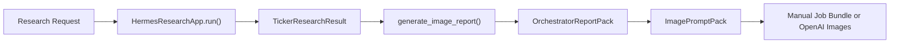

# Hermes

Hermes is a boss-first trading research system.

It takes ticker research requests, runs a canonical multi-stage research pipeline,
produces structured financial conclusions, and now delivers boss-facing report output
through an image-report pipeline.

## What Hermes Does

Hermes is built to answer:

**What should we pay attention to now, why, and how should we act?**

It does this in two layers:

1. **Research layer**
   - research task routing
   - multi-role evidence gathering
   - final signal and report generation
   - bullish decision layering

2. **Delivery layer**
   - report-pack assembly
   - page-by-page image prompt generation
   - manual or OpenAI image report generation

## Current Product Status

| Capability | Status |
|---|---|
| Canonical research pipeline | Shipped |
| Futu-first market data | Shipped |
| Thesis / instrument / options / exit | Shipped |
| Watchlist / validation | Shipped |
| Manual image-report pipeline | Shipped |
| OpenAI image-report automation | Shipped |
| Legacy viewer / PDF surfaces | Secondary / compatibility only |

## Current Bottleneck

Hermes is no longer blocked primarily by workflow architecture.

The next bottleneck is **P20: factor calibration and model routing**:

- fundamentals quality is still too sensitive to sparse analyst evidence
- thin evidence can be misread as `No Trade`
- thesis classification needs a clearer separation between:
  - genuine `No Trade`
  - `Inconclusive` / insufficient coverage
- analyst roles should be routed to models strong enough for the task

In short:

- **P19 solved delivery**
- **P20 is about improving decision quality**

## Near-Term P20 Optimization Goals

Hermes' next phase focuses on making the research engine more factor-aware and more honest about evidence quality.

Planned P20 improvements:

1. **Separate `Inconclusive` from `No Trade`**
   - insufficient evidence should not be presented as a deliberate negative conclusion

2. **Replace fragile fundamentals quality scoring**
   - move away from simple evidence-count-style scoring
   - introduce factorized fundamentals dimensions such as:
     - profitability quality
     - growth quality
     - cash flow quality
     - balance sheet quality
     - capital allocation
     - valuation support
     - evidence coverage

3. **Make coverage explicit**
   - show what dimensions were covered
   - show what dimensions were missing
   - expose classification reason more clearly

4. **Introduce model routing by analyst role**
   - stronger models for fundamentals
   - lighter models where appropriate for technical/news/other structured roles

5. **Improve thesis-state calibration**
   - make thesis outputs more stable, interpretable, and decision-useful

## Main Runtime Flow



## The Most Important Entry Points

### Research

```python
from agent.research_v1.app import HermesResearchApp

app = HermesResearchApp()
research = app.run("Research AAPL fundamentals and options")
```

### Boss report delivery

```python
for tr in research.ticker_results:
    report = app.generate_image_report(
        tr,
        company_name="Apple Inc.",
        mode="manual",   # or "openai"
        output_dir="output/image_reports",
    )
```

## Report Modes

### Manual mode

Generates:

- jobs bundle JSON
- prompt transcripts
- manifest JSON

Use when:

- validating prompts
- no API key is available
- a human or another model will perform the final image generation step

### OpenAI mode

Generates:

- real `.png` page images
- manifest JSON

Use when:

- `OPENAI_API_KEY` is configured
- automatic image generation is desired

## Approved Action Vocabulary

Hermes report output must stay inside this action set:

- `Buy Stock`
- `Buy Call`
- `Bull Call Spread`
- `Sell Cash-Secured Put`
- `Covered Call`
- `Watchlist`
- `No Trade`

Generic visible action language such as `BUY/HOLD/SELL` must not become the primary
boss-facing report language.

## Operator Guidance

If you are a model, agent, or operator newly entering this repository:

1. read this file
2. read [agent/research_v1/README.md](/E:/hermes-agent/agent/research_v1/README.md)
3. read [agent/research_v1/AGENT.md](/E:/hermes-agent/agent/research_v1/AGENT.md)
4. treat `HermesResearchApp.run()` as the research truth
5. treat `generate_image_report()` as the boss-report delivery entrypoint

## Useful Paths

| Path | Purpose |
|---|---|
| `agent/research_v1/` | Canonical pipeline and image-report mainline |
| `tests/agent/research_v1/` | Tests |
| `docs/` | Architecture and operating docs |

## Key Docs

- [agent/research_v1/README.md](/E:/hermes-agent/agent/research_v1/README.md)
- [agent/research_v1/AGENT.md](/E:/hermes-agent/agent/research_v1/AGENT.md)
- [P19 image-report spec](/E:/hermes-agent/docs/superpowers/specs/2026-04-22-hermes-image-report-pipeline-spec.md)
- [P20 factor calibration and model routing spec](/E:/hermes-agent/docs/superpowers/specs/2026-04-23-hermes-factor-calibration-and-model-routing-spec.md)
- [Boss operator prompt](/E:/hermes-agent/docs/boss-model-handoff-prompt.md)
