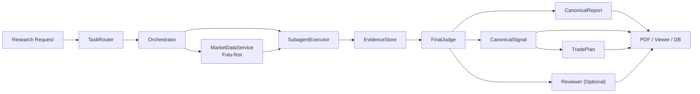

# Hermes

> A boss-first trading research system.
> Research in, structured signal out.

**Hermes** is a single-machine research desk for equity and options workflows.
It takes a ticker request, runs a canonical research pipeline, produces a readable
report, a structured signal, a trade plan, optional review output, and exposes the
result through a viewer, PDF export, and SQLite persistence.

## What Hermes Does

Hermes answers one question well:

**What should we pay attention to now, why, and how should we act on it?**

It closes the loop across:

- Research (multi-analyst, multi-role)
- Structured signal generation
- Trade plan generation
- Optional review gate
- Viewer display
- PDF export
- SQLite persistence
- Futu-first market data with explicit fallback visibility

## System Capabilities

| Capability | Status |
|---|---|
| Canonical research pipeline | Phase 13 complete |
| Futu-first market data | Phase 12 complete |
| Signal generation (S/A/B/C + priority) | Shipped |
| Trade plan generation | Shipped |
| PDF export | Shipped |
| Web viewer (legacy + canonical + batch) | Shipped |
| SQLite persistence | Shipped |
| Directory documentation standards | Repo-enforced |
| Repo-level doc-sync checker | Shipped |
| Watchlist & Alert Center | Phase 16 complete |
| Validation Engine | Phase 17 complete |

## Core Flow



## Market Data Path

Hermes defaults to a **Futu-first** market data path:

- **Primary**: Futu OpenD (U.S. / HK stocks + options)
- **Fallback**: Yahoo Finance (historical prices)
- Fallback reasons remain visible in result metadata

```bash
# Quick market data commands
python -m agent.research_v1.app quote --symbols AAPL,HK.00700
python -m agent.research_v1.app option-chain --symbol GLW --start 2027-01-01 --end 2027-01-31
```

Runtime defaults: `FUTU_OPEND_HOST=127.0.0.1`, `FUTU_OPEND_PORT=11111`, `FUTU_DEFAULT_MARKET=US`

## Product Surfaces

| Surface | Entry point | What it does |
|---|---|---|
| Research app | `agent/research_v1/app.py` | Canonical pipeline for single or multi-ticker research |
| Batch CLI | `agent/research_v1/batch_cli.py` | App init, status, viewer launch, PDF export |
| Viewer | `agent/research_v1/viewer.py` | Legacy / canonical / batch research pages in browser |
| PDF export | `agent/research_v1/report_pdf.py` | Canonical task PDFs and batch research PDFs |
| Database | `agent/research_v1/data/database.py` | SQLite persistence: tasks, signals, reports, batches |

## Quick Start

### Install dependencies

```bash
pip install -r requirements.txt
```

### Run research

```bash
# Single ticker
python -m agent.research_v1.app "Research AAPL"

# Multi-ticker comparison
python -m agent.research_v1.app "Compare AAPL and MSFT"
```

### Initialize and use the local research desk

```bash
# Initialize app root
python -m agent.research_v1.batch_cli --app-root .hermes init

# Open viewer
python -m agent.research_v1.batch_cli --app-root .hermes viewer --host 127.0.0.1 --port 8008

# Export PDF
python -m agent.research_v1.batch_cli --app-root .hermes export-pdf --batch-id 1
```

### Run acceptance checks

```bash
pytest tests/agent/research_v1/test_phase13_acceptance.py -v
```

## Canonical Pipeline

```
Research Request
    ↓
TaskRouter.route() → ResearchTask
    ↓
Orchestrator.decompose() → SubagentTask[] (each role × each ticker)
    ↓
MarketDataService.fetch_context_for_ticker() — Futu-first, fallback tracked
    ↓
SubagentExecutor.execute() → EvidenceItem[] per analyst role
    ↓
EvidenceStore.normalize() → EvidenceBundle
    ↓
FinalJudge.judge() → CanonicalSignal + CanonicalReport
    ↓
SignalPersistencePipeline.persist_canonical_signal() → SQLite
    ↓
TradePlanGenerator.generate() → trade_plan dict
    ↓
Reviewer.review() (optional) → CanonicalReview
    ↓
TickerResearchResult (signal / report / review / trade_plan / audit)
```

Key properties:
- Each ticker gets an independent result; multi-ticker runs are parallelizable
- Fallback reasons are observable in `audit["fallback_reasons"]`
- Canonical outputs coexist with legacy tables — no migration required

## Current Scope

Hermes is a complete, usable product loop for:

- Single-ticker research
- Multi-ticker comparison
- Structured signal generation (rating, confidence, entry, stop, take-profit, horizon, priority)
- Trade plan generation (execute/inhibit, entry zone, sizing, expiry conditions)
- Futu-first market context (snapshot, candles, option chain)
- Viewer display (legacy + canonical + batch modes)
- PDF export
- SQLite persistence
- Repo-level documentation standards (README/AGENT schema enforced in pytest)

## Not Yet the Goal

Hermes is not trying to be:

- A multi-user platform
- A full brokerage terminal
- A distributed agent orchestration system
- A self-improving autonomous trader
- A production trading execution engine

Current focus:

**Make research stable, explainable, reviewable, and deliverable.**

## Repository Map

| Path | Purpose |
|---|---|
| `agent/research_v1/` | Canonical research pipeline |
| `agent/research_v1/analysts/` | Role-specific analyst modules (technical, fundamentals, news, sentiment, industry, options, risk, valuation) |
| `agent/research_v1/data/` | Providers, Futu integration, database |
| `tests/agent/research_v1/` | Unit, integration, and acceptance tests |
| `docs/` | Architecture, workflow, acceptance, user-facing docs |
| `.git_hooks/` | Local doc-sync tooling |

## Documentation

- [System Architecture](docs/system-architecture.md)
- [Product Acceptance](docs/product-acceptance.md)
- [Developer Workflow](docs/developer-workflow.md)
- [Documentation Standards](docs/doc-standards.md)
- [Boss Manual](docs/boss-manual.md)
- [System Overview](docs/system-overview.md)

## Repo Discipline

Hermes enforces directory-level documentation standards through automated tests:

- Every tracked directory must have `README.md` and `AGENT.md`
- README files must contain required sections (What This Directory Is, Contents, Relationship, If You Modify, Data Flow)
- AGENT files must contain required sections (Responsibilities, Boundaries, Key Interfaces, Upstream/Downstream, Change Propagation, Tests/Verification, What NOT)
- Doc-sync behavior is validated in `test_doc_standards.py` and runs as part of the normal pytest suite

Run the repo standards check:

```bash
pytest tests/agent/research_v1/test_doc_standards.py -v
```

## Disclaimer

Hermes is a research and signal system — not investment advice.
Markets carry risk; strategy effectiveness varies with market conditions.
Always combine with your own judgment, capital constraints, and risk tolerance before trading.

## License

MIT License. See [LICENSE](LICENSE).
