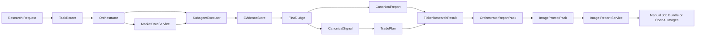

# `agent/research_v1/` - Canonical Research and Image Report Pipeline

## What This Directory Is

This is the primary implementation directory for Hermes.

It owns the full canonical research pipeline:

- natural-language request intake
- research task decomposition
- market-data collection
- multi-role evidence gathering
- final signal and report generation
- bullish decision layers (thesis, instrument, options, exit, watchlist, validation)
- persistence
- image-report generation inputs and automation

If a model is asked to "run Hermes", "research a ticker", "generate a boss report", or
"produce the poster/report images", this directory is the main place it must understand.

## Current Product Direction

Hermes now has two distinct layers:

1. **Research decision layer**
   - produces the actual financial judgment
   - ends at `TickerResearchResult`

2. **Report delivery layer**
   - converts research outputs into boss-facing deliverables
   - Phase 19 mainline is now **image-report-first**
   - image reports are generated from:
     - `OrchestratorReportPack`
     - `ImagePromptPack`
     - manual or OpenAI image generation backends

The old HTML/CSS/PDF-first report direction is no longer the main Phase 19 architecture.

Hermes is now entering **P20: factor calibration and model routing**.

## Data Flow

Hermes now has two connected flows.

The research flow starts with a natural-language research request, routes it
through task decomposition, market-data collection, analyst evidence, final
judgment, canonical signal/report objects, and optional image-report generation.

The governance flow starts from P20-P30 evidence, then runs P31 readiness,
P32 artifact registry and dry-run generation validation, P33 signal-family edge
review, P34 boss governance brief, P35 local runtime orchestration, and P36
recommendation outcome tracking. This flow writes append-only governance
artifacts under `output/governance/YYYY-MM-DD/` and does not create broker
orders or production approval.

#### P36 Outcome Tracking

`recommendation_outcomes.py` consumes canonical signals and canonical reports
after research has completed. It persists forward outcome rows in
`canonical_recommendation_outcomes`, then emits standalone P36 artifacts under
`output/governance/YYYY-MM-DD/`. The flow is one-way and read-only with respect
to research decisions: outcomes do not alter `final_judge`, `RoleWeightConfig`,
P33 edge review, P35 runtime, or production configuration in P36.

#### P37 Market Regime Context

`market_regime_context.py` consumes market proxy histories and emits a
standalone market-regime snapshot. The flow is one-way: market context is
persisted and written to artifacts, but it does not alter `final_judge`,
`RoleWeightConfig`, `JudgeInputPacket`, P35 governance runtime, P36 outcome
tracking, or production configuration in P37.

#### P38 Fundamental Quality Engine

`fundamental_quality.py` consumes point-in-time financial rows and emits
standalone fundamental-quality reports. The flow is one-way: quality reports
are persisted and written to artifacts, but P38 does not alter
`_extract_thesis_inputs()`, `ThesisEngine`, `final_judge`, `RoleWeightConfig`,
`JudgeInputPacket`, P35 governance runtime, P36 outcome tracking, P37
market-regime context, or production configuration.

#### P39 Candidate Pool Engine

`candidate_pool.py` consumes a point-in-time ticker universe plus read-only
P36/P37/P38 evidence. It emits a candidate pool for human review. The flow
is one-way: candidate-pool artifacts do not call `HermesResearchApp.run()`,
`final_judge`, `_extract_thesis_inputs()`, or broker/order APIs.

#### P40 Research Memory Pack

`research_memory_pack.py` reads prior Hermes artifacts and DB rows for a
ticker and emits a deterministic memory pack. The flow is one-way: memory
packs do not call `HermesResearchApp.run()`, `final_judge`,
`JudgeInputPacket`, or broker/order APIs.

#### P41 Decision Journal Guardrails

`decision_journal_guardrails.py` reads explicit boss decision-journal input
plus read-only P40 memory packs and emits behavioral guardrail evidence.
The flow is one-way: decision journal entries do not call
`HermesResearchApp.run()`, `final_judge`, `JudgeInputPacket`, or
broker/order APIs.

#### P42 Boss Co-Pilot Daily Brief

`boss_copilot_daily_brief.py` reads persisted P36-P41 evidence and emits a
daily research-priority brief for the boss. The flow is one-way: P42 does
not call `HermesResearchApp.run()`, `final_judge`, P36-P41 runtime commands,
or broker/order APIs. Missing upstream evidence is surfaced as limited
context rather than hidden.

#### P43 Read-Only Co-Pilot Console Index

`copilot_console_index.py` scans existing files under `output/governance/YYYY-MM-DD/` and writes a static index for navigation. The flow is one-way: P43 does not invoke P36-P42 runtimes, `HermesResearchApp.run()`, `final_judge`, or broker/order APIs.

#### P44 Evidence Freshness & Drift Monitor

`evidence_freshness_drift_monitor.py` reads persisted P36-P43 evidence and governance artifacts, then emits a deterministic evidence-health report. The flow is one-way: P44 does not invoke P36-P43 runtimes, `HermesResearchApp.run()`, `final_judge`, or broker/order APIs.

#### P45 Futu Market Data Readiness

`market_data_readiness.py` checks whether the Futu SDK is installed, whether OpenD is reachable, and optionally verifies live snapshot/history/option-chain calls. It writes readiness artifacts under `output/governance/YYYY-MM-DD/`. The flow is one-way: P45 does not place orders, unlock trading, use trade contexts, query positions, invoke P36-P44 runtimes, or mutate research decisions.

#### P46 Controlled Evidence Refresh Planner

`evidence_refresh_planner.py` consumes the latest P44 freshness/drift monitor and P45 market-data readiness report, then writes a dry-run refresh plan under `output/governance/YYYY-MM-DD/`. The flow is one-way: P46 does not refresh evidence, call market-data providers, invoke P36-P45 runtimes, or mutate research decisions.

That means the next core engineering problem is no longer "how to deliver the report",
but rather:

- how fundamentals quality should be scored
- how to distinguish insufficient coverage from true `No Trade`
- how to route analyst roles to stronger or lighter models appropriately

## Main Flow



## Key Files

### Canonical Pipeline Host

- **`app.py`**
  - owns `HermesResearchApp`
  - main entrypoint for research
  - now also exposes `generate_image_report(...)`

### Canonical Research Components

- **`task_router.py`** - request -> `ResearchTask`
- **`orchestrator.py`** - workflow control, evidence readiness, judge packet assembly
- **`subagent_executor.py`** - analyst execution
- **`evidence_store.py`** - normalize raw analyst output
- **`final_judge.py`** - produce `CanonicalSignal` + `CanonicalReport`
- **`reviewer.py`** - optional quality review
- **`signal_pipeline.py`** - persistence of canonical outputs
- **`trade_plan.py`** - legacy-compatible trade plan generation

### Bullish Decision Layers

- **`thesis_engine.py`** - `UnderlyingThesis`
- **`instrument_selection.py`** - `InstrumentRecommendation`
- **`options_decision.py`** - `OptionsStructure`
- **`early_exit.py`** - `EarlyExitPlan`
- **`watchlist_alerts.py`** - `WatchlistEntry` / alert behavior
- **`validation_engine.py`** - `ValidationResult`

### Report Delivery - Phase 19 Mainline

- **`orchestrator_reporting.py`**
  - builds `OrchestratorReportPack`
  - this is the content truth for boss-facing reports

- **`image_report_contracts.py`**
  - defines image-report objects:
    - `OrchestratorReportPack`
    - `ImagePromptPack`
    - `ImageReportArtifacts`
    - generation result wrappers

- **`image_prompt_builder.py`**
  - converts `OrchestratorReportPack` into page-by-page prompts

- **`image_report_generator.py`**
  - backend abstraction for image generation
  - supports:
    - `ManualImageJobBackend`
    - `OpenAIImageBackend`

- **`image_report_service.py`**
  - chains:
    - `TickerResearchResult`
    - `OrchestratorReportPack`
    - `ImagePromptPack`
    - image generation result

### Older Secondary Report Surfaces

- **`viewer.py`**
  - browser viewer for stored results
- **`report_pdf.py`**
  - older PDF-oriented export path

These still exist, but they are no longer the strategic Phase 19 mainline.

## The Actual Result Object You Should Trust

For any new work, the most important runtime object is:

- `TickerResearchResult`

It contains:

- `signal`
- `report`
- `review`
- `trade_plan`
- `thesis`
- `instrument_recommendation`
- `decision_card`
- `options_structure`
- `early_exit`
- `watchlist_entry`
- `validation`

Phase 19 report delivery must derive from these real decision objects, not from old generic
`BUY/HOLD/SELL` presentation shells.

## Image Report Modes

Hermes supports two report-generation modes:

### 1. Manual mode

Use when:

- no API key is configured
- human-in-the-loop generation is desired
- validating prompts and page structure

Output:

- jobs bundle JSON
- per-page prompt files
- manifest JSON

Entry:

- `HermesResearchApp.generate_image_report(..., mode="manual")`

### 2. OpenAI mode

Use when:

- `OPENAI_API_KEY` is configured
- automatic image generation is desired

Output:

- real `.png` page artifacts
- manifest JSON

Entry:

- `HermesResearchApp.generate_image_report(..., mode="openai")`

## Quick Start

### Run research

```bash
python -m agent.research_v1.app "Research AAPL"
```

### Programmatic research

```python
from agent.research_v1.app import HermesResearchApp

app = HermesResearchApp()
research = app.run("Research AAPL fundamentals and options")

for tr in research.ticker_results:
    print(tr.ticker, tr.decision_card.primary_action if tr.decision_card else None)
```

### Generate a manual image-report bundle

```python
from agent.research_v1.app import HermesResearchApp

app = HermesResearchApp()
research = app.run("Research AAPL fundamentals and options")

for tr in research.ticker_results:
    result = app.generate_image_report(
        tr,
        company_name="Apple Inc.",
        mode="manual",
        output_dir="output/image_reports",
    )
    print(result.phase_19a_job_state)
    print(result.job_bundle_path)
```

### Generate images automatically with OpenAI

```python
from agent.research_v1.app import HermesResearchApp

app = HermesResearchApp()
research = app.run("Research AAPL fundamentals and options")

for tr in research.ticker_results:
    result = app.generate_image_report(
        tr,
        company_name="Apple Inc.",
        mode="openai",
        output_dir="output/image_reports",
    )
    print(result.artifacts_present)
    print(result.manifest_path)
```

Environment:

```bash
set OPENAI_API_KEY=your_key_here
set OPENAI_IMAGE_MODEL=gpt-image-2
```

## Relationship to Other Directories

- **`tests/agent/research_v1/`**
  - authoritative test mirror of this directory

- **`docs/`**
  - architecture, acceptance, workflow, operator docs

- **`agent/research_v1/data/`**
  - persistence and provider layer

- **`agent/research_v1/analysts/`**
  - analyst role implementations used by `subagent_executor.py`

## If You Modify Code Here

- `app.py`
  - check `test_app_integration.py`
  - check `test_bullish_decision_integration.py`
  - check `test_image_report_pipeline.py`

- `contracts.py`
  - check all dataclass consumers

- `orchestrator_reporting.py`
  - check `test_image_report_pipeline.py`
  - verify locked facts still match true decision objects

- `image_prompt_builder.py`
  - check `test_image_report_pipeline.py`
  - verify approved action vocabulary is preserved

- `image_report_generator.py`
  - check `test_image_report_pipeline.py`
  - verify manual and openai modes both still work

- `image_report_service.py`
  - check `test_image_report_pipeline.py`
  - verify main entrypoints still produce valid artifacts

- `viewer.py` / `report_pdf.py`
  - treat as secondary surfaces
  - do not confuse them with the new Phase 19 mainline

## Canonical Decision Vocabulary

Visible action language must stay inside this approved set:

- `Buy Stock`
- `Buy Call`
- `Bull Call Spread`
- `Sell Cash-Secured Put`
- `Covered Call`
- `Watchlist`
- `No Trade`

Do not let report delivery regress into generic visible UI language such as:

- `BUY`
- `HOLD`
- `SELL`

## What a New Model Should Do First

If a new model is dropped into Hermes and told to work on the system, it should:

1. read this file
2. read `agent/research_v1/AGENT.md`
3. understand that `TickerResearchResult` is the real research output
4. understand that Phase 19 mainline is image-report-first
5. understand that `generate_image_report(...)` is the top-level report delivery entrypoint

## Useful Tests

```bash
python -m pytest tests/agent/research_v1/test_bullish_decision_integration.py -q
python -m pytest tests/agent/research_v1/test_validation_engine.py -q
python -m pytest tests/agent/research_v1/test_watchlist_alerts.py -q
python -m pytest tests/agent/research_v1/test_image_report_pipeline.py -q
```
